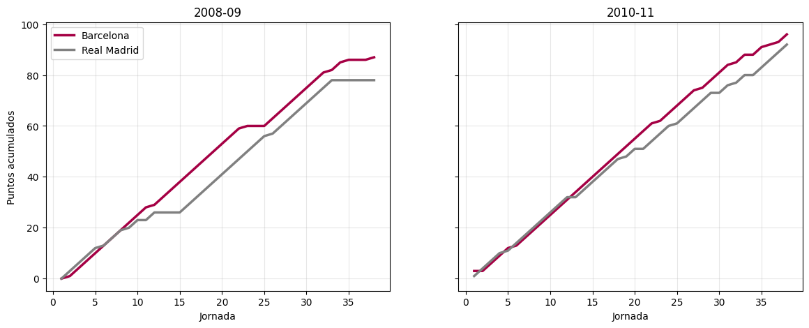
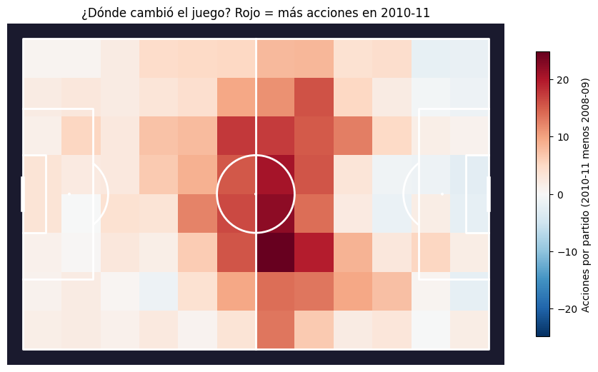
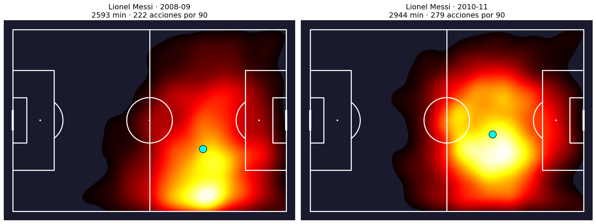
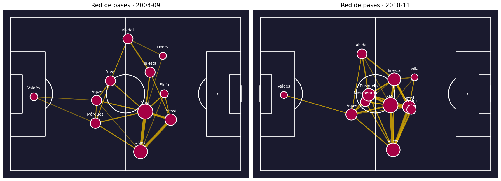

# ⚽ Barça de Guardiola: 2008-09 vs 2010-11

Análisis de datos comparando las dos ligas que ganó el FC Barcelona de Pep Guardiola, usando resultados de toda la liga y datos de eventos de StatsBomb (cada pase, tiro y acción con sus coordenadas en la cancha).

[](https://colab.research.google.com/drive/1E94mQ6VKjJ_Bk_YNxRKfigSX7dt8jD43?usp=sharing)


---

## 📌 Pregunta principal

El Barça de 2010-11 sumó **9 puntos más** que el de 2008-09, pero metió **10 goles menos**. ¿Qué cambió entre un equipo y otro?

- ¿Fue una mejora defensiva real o algo más?
- ¿Cómo cambió el estilo de juego?
- ¿Qué impacto tuvo el paso de Messi de extremo a falso 9?

---

## 📊 Datos

| Fuente | Qué contiene | Cobertura |
|---|---|---|
| [StatsBomb Open Data](https://github.com/statsbomb/open-data) | Eventos con coordenadas: pases, tiros, xG, regates, presiones, recuperaciones | 31 partidos (2008-09) y 33 partidos (2010-11) |
| [DataHub / football-data.co.uk](https://datahub.io/football/spanish-la-liga) | Resultados y estadísticas de partido de toda La Liga | 380 partidos por temporada |

**Archivos en `data/`:**

| Archivo | Descripción |
|---|---|
| `liga_resultados.csv` | Los 760 partidos de las dos ligas: goles, goles al descanso, tiros, tiros al arco, faltas, córners, tarjetas |
| `statsbomb_eventos.csv` | ~236 mil acciones con balón de ambos equipos: tipo, jugador, coordenadas, destino del pase, receptor, xG |
| `statsbomb_minutos.csv` | Minutos jugados por jugador en cada partido (calculados con titulares, cambios y expulsiones) |
| `statsbomb_partidos.csv` | Lista de los 64 partidos del Barça con rival, condición y marcador |

---

## 🔍 Hallazgos principales

### 1. Más puntos con menos goles

| Indicador | 2008-09 | 2010-11 |
|---|---|---|
| Puntos | 87 | **96** |
| Goles a favor | **105** | 95 |
| Goles en contra | 35 | **21** |
| Vallas invictas | 15 | **19** |
| Tiros por partido | **18.6** | 15.6 |
| Tiros al arco del rival por partido | 2.9 | 2.9 |
| % de tiros al arco del rival que fueron gol | 32.1% | **19.3%** |
| Puntos del Real Madrid | 78 | 92 |

El Real Madrid de 2010-11 fue mucho más fuerte (92 puntos), así que los 96 puntos hacían falta.



### 2. La "mejora defensiva" no fue conceder menos ocasiones

Los rivales tiraron al arco **lo mismo** en ambas temporadas, y según el xG generaron **incluso un poco más de peligro** en 2010-11 (0.70 xG por partido contra 0.62).

| | 2008-09 | 2010-11 |
|---|---|---|
| xG de los rivales por partido | 0.62 | 0.70 |
| Goles de los rivales menos su xG | **+9.9** | **−5.0** |

En 2008-09 los rivales definieron muy por encima de lo esperado y en 2010-11 por debajo. Buena parte de los 14 goles menos recibidos se explica por la definición rival y el rendimiento de Valdés, no por conceder menos ocasiones.

### 3. Un estilo de posesión más extremo

| Por partido | 2008-09 | 2010-11 |
|---|---|---|
| Pases | 611 | **790** |
| Posesión (aprox.) | 64.5% | **70.7%** |
| Acierto de pase | 82.6% | **87.9%** |
| Tiros | **18.6** | 15.2 |
| xG | **2.34** | 1.86 |
| Presiones | 121 | 119 |

El equipo de 2010-11 tuvo más la pelota y la movió con más precisión, a cambio de tirar menos. La intensidad de la presión no cambió.



El aumento de acciones se concentró en el **círculo central y la mitad de campo rival**.

### 4. Messi: de extremo derecho a falso 9

| Messi | 2008-09 | 2010-11 |
|---|---|---|
| % de acciones en la banda derecha | 54.9% | 38.3% |
| % de acciones por el centro | 33.4% | 45.3% |
| Tiros | 111 | 146 |
| Goles | 23 | **31** |
| xG | 16.9 | 24.2 |
| Asistencias | 11 | **18** |



El cambio se mantiene en casi todos los partidos de 2010-11, así que no fue algo puntual. Con Messi por el centro, el delantero se abrió: Eto'o jugaba centrado y Villa partía desde la izquierda.

### 5. El mediocampo como máquina de circulación

| Por 90 minutos | Xavi 08-09 | Xavi 10-11 | Busquets 08-09 | Busquets 10-11 |
|---|---|---|---|---|
| Pases | 88 | **124** | 60 | **93** |
| Acierto de pase | 85.7% | **91.8%** | 85.3% | **91.8%** |

Xavi dio menos pases clave (de 3.4 a 2.4 por 90) y menos asistencias (de 17 a 7): pasó de dar el último pase a dirigir la circulación. El último pase quedó en manos de Messi y Dani Alves.

### 6. Red de pases



El triángulo **Dani Alves, Xavi y Messi** por la derecha fue el eje de ambos equipos, con 14-15 pases por partido entre ellos. En 2010-11 la red es más compacta y adelantada.

---

## 🛠️ Metodología

- **Formato equipo-partido:** cada partido se transformó en dos filas (una por equipo) para calcular todo desde el punto de vista de cada equipo.
- **Z-scores:** cada indicador se comparó con el promedio de los 20 equipos de su temporada, para no comparar números absolutos de ligas distintas.
- **Métricas por 90 minutos:** los minutos de cada jugador se calcularon con titulares, cambios y expulsiones.
- **Posesión aproximada:** proporción de pases de cada equipo en el partido.
- **Visualizaciones de cancha:** mapas de calor, mapas de tiros y redes de pases con `mplsoccer`.

---

## 📁 Estructura del repositorio

```
├── README.md
├── Barcelona__2009_vs__2011.ipynb
├── datos_barca_guardiola.zip
├── carrera_titulo.png
├── diferencias_equipo.png
├── messi_heatmap.png
└── red_pases.png
```

---

## ▶️ Cómo ejecutarlo

1. Abre el notebook en Colab con el botón de arriba.
2. Ejecuta la primera celda para instalar `mplsoccer`.
3. Descarga `data/datos_barca_guardiola.zip` de este repositorio y súbelo cuando la celda de carga lo pida.
4. Ejecuta el resto de celdas en orden.

**Librerías:** `pandas`, `numpy`, `matplotlib`, `mplsoccer`


---

## 🙏 Créditos

Datos de eventos proporcionados por **[StatsBomb](https://statsbomb.com/)** a través de su repositorio de datos abiertos.

Resultados de liga de **[DataHub](https://datahub.io/football/spanish-la-liga)** / **football-data.co.uk**.

---

## 👤 Autor


- **Autores:** Jose Maquera Martinez
- **Email:** josemaqueramar@gmail.com
- **Estudiante de:** Estadística, UNMSM (8vo ciclo)
- **LinkedIn:** [Jose Maquera](https://linkedin.com/in/josemaqueramartinez/)
- **GitHub:** [github.com/JoseMaqueraMartinez](https://github.com/JoseMaqueraMartinez/)
